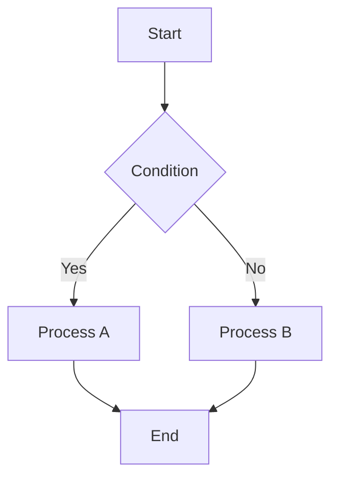
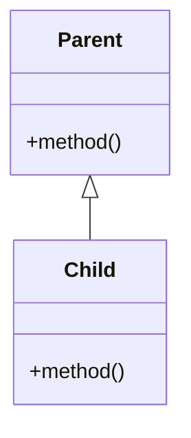

# Code Explanation Implementation Playbook

This file contains detailed patterns, checklists, and code samples referenced by the skill.

## Instructions

### 1. Code Analysis

Analyze the code for:

- Complexity (cyclomatic, cognitive)
- Design patterns used
- Interaction between components
- Potential pitfalls and edge cases
- Optimization opportunities

### 2. Explanation Strategy

1. **Overview**: High-level summary
2. **Step-by-Step**: Detailed walkthrough
3. **Deep Dive**: Complex logic explanation
4. **Visual Aids**: Diagrams and flow charts
5. **Practical Examples**: Real-world use cases

### 3. Visual Diagrams

#### Flow Control (Mermaid)



#### Class Relationships



### 4. Interactive Examples

```python
def example_usage():
    # Show how to use the feature
    pass
```

### 5. Concept Breakdown

```python
def explain_concept(concept):
    """Explain a coding concept with examples"""
    examples = {
        'async': 'Asynchronous programming fundamentals explanation',
        'inheritance': 'Inheritance and polymorphism explanation'
    }
    return examples.get(concept, "No example available")
```

### 6. Design Pattern Explanation

#### Pattern Recognition and Explanation

```python
class DesignPatternExplainer:
    def explain_pattern(self, pattern_name, code_example):
        """
        Explain design pattern with diagrams and examples
        """
        patterns = {
            'singleton': 'Singleton pattern explanation',
            'observer': 'Observer pattern explanation'
        }
        return patterns.get(pattern_name, "Pattern explanation not available")
```

### 7. Common Pitfalls and Best Practices

#### Code Review Insights

```python
def analyze_common_pitfalls(self, code):
    """
    Identify common mistakes and suggest improvements
    """
    issues = []
    
    # Check for common Python pitfalls
    pitfall_patterns = [
        {
            'pattern': r'except:',
            'issue': 'Bare except clause',
            'severity': 'high',
            'explanation': 'Explanation of bare except'
        },
        {
            'pattern': r'def.*\(\s*\):.*global',
            'issue': 'Global variable usage',
            'severity': 'medium',
            'explanation': 'Explanation of global usage'
        }
    ]

    for pitfall in pitfall_patterns:
        if re.search(pitfall['pattern'], code):
            issues.append(pitfall)
    
    return issues
```

### 8. Learning Path Recommendations

#### Personalized Learning Path

```python
def generate_learning_path(self, analysis):
    """
    Create personalized learning recommendations
    """
    learning_path = {
        'current_level': analysis['difficulty_level'],
        'identified_gaps': [],
        'recommended_topics': [],
        'resources': []
    }
    
    # Identify knowledge gaps
    if 'async' in analysis['concepts'] and analysis['difficulty_level'] == 'beginner':
        learning_path['identified_gaps'].append('Asynchronous programming fundamentals')
        learning_path['recommended_topics'].extend([
            'Event loops',
            'Coroutines vs threads',
            'Async/await syntax',
            'Concurrent programming patterns'
        ])
    
    # Add resources
    learning_path['resources'] = [
        {
            'topic': 'Async Programming',
            'type': 'tutorial',
            'title': 'Async IO in Python: A Complete Walkthrough',
            'url': 'https://realpython.com/async-io-python/',
            'difficulty': 'intermediate',
            'time_estimate': '45 minutes'
        }
    ]
    
    return learning_path
```

## Output Format

1. **Complexity Analysis**: Overview of code complexity and concepts used
2. **Visual Diagrams**: Flow charts, class diagrams, and execution visualizations
3. **Step-by-Step Breakdown**: Progressive explanation from simple to complex
4. **Interactive Examples**: Runnable code samples to experiment with
5. **Common Pitfalls**: Issues to avoid with explanations
6. **Best Practices**: Improved approaches and patterns
7. **Learning Resources**: Curated resources for deeper understanding
8. **Practice Exercises**: Hands-on challenges to reinforce learning

Focus on making complex code accessible through clear explanations, visual aids, and practical examples that build understanding progressively.
